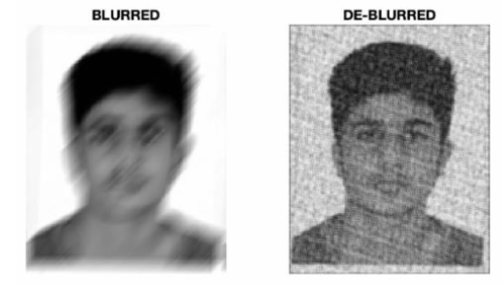

# DE-BLURRING MOTION BLURRED IMAGES

## Overview
This project aims to develop an innovative and computationally efficient method for restoring motion-blurred square images. By leveraging the **Radon transform**, our technique accurately estimates the motion blur angle and applies an inverse motion blur filter to restore the image's sharpness.

## Problem Statement
Motion blur occurs when there is relative motion between the camera and the subject being captured, resulting in the smearing or elongation of objects in the image. This project addresses this issue by focusing on square images, commonly encountered in various domains like computer vision, image processing, and pattern recognition.

## Approach
1. **Radon Transform Analysis**:  
   The project uses the Radon transform to analyze the image's projection profiles at different angles. This helps in understanding the blur characteristics.

2. **Maximum Variance Method**:  
   By examining the variance in each column of the Radon transform output, the column with the highest variance is identified. This column corresponds to the angle at which the blur occurred, allowing for an accurate estimation of the motion blur angle.

3. **Inverse Motion Blur Filter**:  
   Once the blur angle is determined, an inverse motion blur filter is applied. This filter compensates for the motion in the opposite direction, restoring the image's sharpness.

## Key Features
- **Accurate Motion Blur Angle Estimation**: Utilizes the maximum variance method to precisely determine the blur angle.
- **Computational Efficiency**: Efficiently analyzes projection profiles using the Radon transform, making it suitable for real-time applications.
- **Tailored for Square Images**: Specifically designed to address motion blur in square images, providing specialized solutions.
